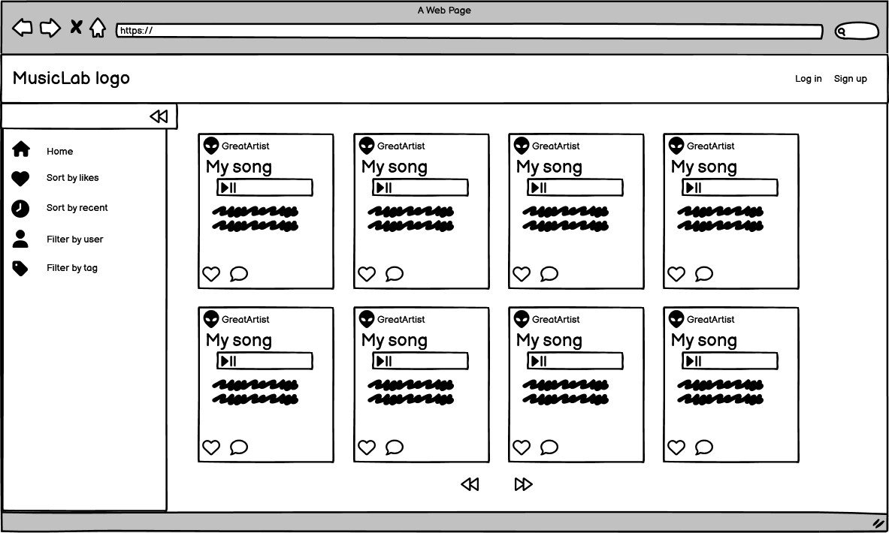
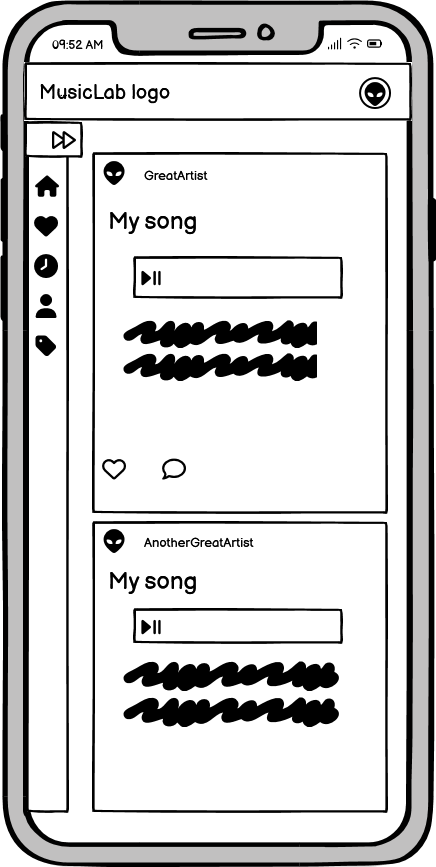
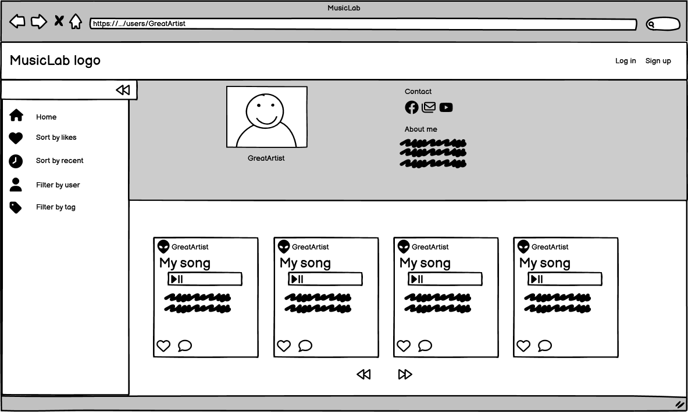
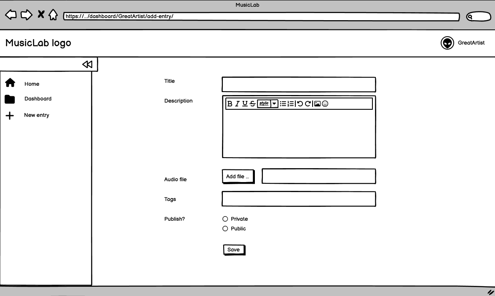
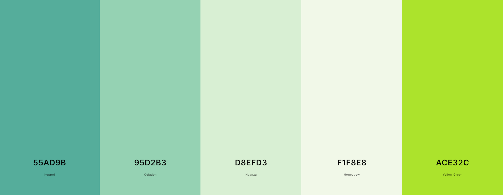

# MusicLab
MusicLab is a music blog - a place where artists can share their creations, give and receive constructive feedback, and explore fresh avenues of collaboration. It is a space for musicians of each and every skill level and all genres to show their music to the public and start conversations about music-related topics.


The live link for "MusicLab" can be found [HERE](https://music-lab-11c9945eb758.herokuapp.com/)

## Table of Contents


## UX

### Site Purpose:
The intent of the site is to provide a space for a community of aspiring musicians and songwriters of all skill levels where they can share their work, discuss it with others, receive feedback on works in progress, and maybe even make friends or start a band.

### Site Goal:
The goal is to have a platform that connects creators and helps them support each other. It aims to reduce the hurdle of getting your own music heard as an amateur by encouraging drafts and work-in-progress uploads.

### Audience:
Creators, musicians, songwriters of all ages and skill levels with a passion for music. The site is mainly geared toward amateurs, hobbyists and unpublished creators looking for feedback or collaboration opportunities.

### Current User Goals:
For creators to quickly upload their music with a description and to browse and comment on other creators' entries.

### New User Goals:
For visitors to get immediate access to all published musical creations and to feel intrigued about joining and uploading their own work.

### Future Goals:
An important feature that I did not had the time to implement yet is "Collaboration projects". This feature would greatly help promote the core principle of the page - bringing creators together on joint projects - by streamlining the work on a project and reducing some of the social hurdles of teamwork.
In short, creators could start a collab project and invite specific users to join or allow all interested users to request admission to the project. All members would be able upload their demos and mixes to the project and discuss them, before releasing the final master to the public.


## User Stories

### Admin stories:
#### As an admin:
1. I can **moderate entries** so that **they are tagged correctly and no inappropriate content is uploaded**.
2. I can **moderate comments** so that **the feedback provided is appropriate**.
3. I can **delete users who break the rules** so that **toxic behavior is discouraged**.

### Visitor stories:
#### As a visitor:
1. I can **visit the site** so that **I can browse entries made by the creators**.
2. I can **open individual user profiles** so that **I can find information about a creator**.
3. I can **sort all entries by date or likes** so that **I can easily find the newest and the most popular entries**.
4. I can **filter all entries by tag** so that **I can explore certain styles, languages, instruments etc**.
5. I can **filter all entries by username** so that **I can explore new artists**.
6. I can **read the 'About' page** so that **I am informed about the principles and rules of this website**.
7. I can **sign up** so that **I can start contributing by liking, commenting, or adding entries**.

### Creator stories:
#### As a creator:
1. I can **update my user profile** so that **others get to know me and find out how to contact me**.
2. I can **upload my work** so that **I can share it with others and receive feedback**.
3. I can **edit my entries** so that **I can change their presentation and add additional audio files**.
4. I can **add audio files to my existing entry** so that **others can follow my work in progress**.
5. I can **make my entry private** so that **it is not shown to others**.
6. I can **delete my entry** so that **it gets deleted from the database and becomes unavailable**.
7. I can **like an entry** so that **other creators feel appreciated**.
8. I can **unlike an entry** so that **I can remove entries from my favorites**.
9. I can **view all entries I liked** so that **I can quickly find my favorite creations**.
10. I can **leave a comment for an entry** so that **I can start or partake in discussions and connect with others**.
11. I can **edit my comment** so that **I can fix errors**.
12. I can **delete my comment** so that **it is no longer available**.
13. I can **view all comments I have written** so that **I can continue my discussions**.
14. I can **submit a message to the admin** so that **I can give feedback on the site functionality, report an issue or ask something**.
15. I can **log out of my account** so that **unauthorized access is prevented**.

## Design

Being someone who gets easily distracted by popups, banners, notifications, and other elements demanding immediate attention, and having watched others struggle with an overwhelming flood of information and hard-to-find functions, I tried to focus on readability and ease-of-use when choosing link placement, fonts, and icons. I strived to build an accessible page that is easy to navigate and puts the content - the audio files - first.
To achieve this, I ...
- used a simple, readable font
- used commonly known icons
- refrained from using too many colors, too dark or too bright backgrounds
- made sure the audio elements would not autoplay on load
- made sure that links and buttons were selectable with the ```TAB``` key
- made sure to hide or disable elements irrelevant to the current page

### Planning
As part of the planning process, I made a list of all basic functions that an MVP should have and drafted the basic page layout.

The project's kanban board with the core user stories can be found here: [MusicLab Kanban board](https://github.com/users/RikaIljina/projects/2/views/1)

### Wireframes:

#### Main page:


#### Main page on mobile:


#### 'User profile' page:


#### 'Add new entry' page:


### Sitemap:


### Database schema:


### Color Scheme:


### Typography:
The page uses the font "Raleway" for all text.
The font is being imported from Google Fonts.
When users add a profile bio or a song description, they can use the Summernote richtext editor to format their text. There, they can add some basic formatting as well as choose one of the following fonts:
- Arial
- Arial Black
- Courier New
- Helvetica

### Imagery:
The website uses images sparingly to not distract from the main purpose of the site.
The logo was adapted from an icon found on Flaticon.
The background images on the Login, Signup and Signout pages are taken from Freepik. They create a pleasant backdrop for the otherwise plain pages, while their musical theme prepares the user for a hopefully amazing musical experience.
See credits for source attribution.


## Features

### Existing Features:

#### Navigation

The website has a navigation bar containing the logo and the account buttons at the top. This bar is shown on every page.

- Navigation bar on desktops:

- Navigation bar on mobile devices:

The website also has a collapsible sidebar that is shown everywhere but on the Login/Signup pages and the error pages. The sidebar automatically collapses on mobile devices and can be left in an expanded or collapsed state by the user on larger screens.
The sidebar icons differ depending on whether the user is on the main page or in their personal dashboard.

- Sidebar on desktops, main page:

- Sidebar on desktops, dashboard:

- Sidebar on mobile devices, main page:

- Sidebar on mobile devices, dashboard:

#### Viewing
All users have access to the main page with all entries in card form:

Users can click the card or the card title to open the full-page view of the card containing the entry description and the comment section:

Users can also click on the username on a card to navigate to the profile page of a user containing their 'About me' and 'Contact' info as well as all their public entries in card form:

Users can click the 'About' link at the bottom of the sidebar to access the 'About' page outlining the idea behind the website and the rules and providing a way to send feedback to the site admins:

Authenticated users can view all their public and private entries in their personal dashboard:

Authenticated users can also view their 'Comments' and 'Favorites' pages:

#### Editing

Authenticated users can click on the 'Edit' button on their profile page beneath their large avatar or click the 'Update profile' link in the dropdown menu in the upper navigation bar to open the "Edit profile" form and update their data:

Authenticated users can click on an existing entry to get access to the 'Edit'/'Delete' buttons:

A click on 'Edit' opens the 'Edit entry' form where users can change their entry data or upload another version of their song:

A click on 'Delete' opens a modal that asks for confirmation before deleting the song permanently:

Authenticated users can use the 'Like' button to like/unlike entries anywhere on the page where entries are displayed:

Authenticated users can edit and delete their comments on all pages where comments are displayed:

Authenticated users can send a message to the admins on the 'About' page:

#### Logging in

Users can use the 'Login'/'Sign up' buttons on the upper navbar to create an account or log in:

They can sign out via the link in the dropdown with their avatar and name in the navbar:

#### Accessibility
!!!
Adding labels to icons made site more jumpy, elements showing and then disappearing
next time use aria-label instead of fa-tags und bootstrap tags

#### Error pages

The website has four custom  error pages:
- 400 for bad requests
- 403 for cases where users try to access a page or perform an action they are not authorized to
- 404 for pages that don't exist
- 500 for server errors

All error pages provide a short description of the error and a link to get back to the main page. 

### Future Features:

- [ ] Account management for users: Change password, reset password, delete account
- [ ] Collaboration page that allows creators to start joint projects
- [ ] Flagging option to allow users to report inappropriate content
- [ ] Direct messaging system for private user communication
- [ ] Notifications that inform creators about new comments or likes
- [ ] Follower feature
- [ ] Custom audio player


## Codebase

### Project tree

<details>
<summary>Project file structure</summary>

```

PortfolioProject4
├─ comments
│  ├─ admin.py
│  ├─ apps.py
│  ├─ forms.py
│  ├─ migrations
│  ├─ models.py
│  ├─ templates
│  │  └─ comments
│  │     └─ snippets
│  │        └─ comment_section.html
│  ├─ tests.py
│  ├─ urls.py
│  ├─ utils.py
│  ├─ views.py
│  ├─ __init__.py
│  └─ __pycache__
├─ entries
│  ├─ admin.py
│  ├─ apps.py
│  ├─ forms.py
│  ├─ migrations
│  ├─ models.py
│  ├─ templates
│  │  └─ entries
│  │     ├─ entry_details.html
│  │     ├─ entry_form.html
│  │     └─ snippets
│  │        ├─ entry_cards.html
│  │        └─ entry_fullpage.html
│  ├─ tests.py
│  ├─ urls.py
│  ├─ utils.py
│  ├─ views.py
│  ├─ __init__.py
│  └─ __pycache__
├─ likes
│  ├─ admin.py
│  ├─ apps.py
│  ├─ forms.py
│  ├─ migrations
│  ├─ models.py
│  ├─ templates
│  │  └─ likes
│  │     └─ snippets
│  │        └─ like_comment_summary.html
│  ├─ tests.py
│  ├─ urls.py
│  ├─ views.py
│  ├─ __init__.py
│  └─ __pycache__
├─ mainpage
│  ├─ admin.py
│  ├─ apps.py
│  ├─ forms.py
│  ├─ migrations
│  ├─ models.py
│  ├─ signals.py
│  ├─ templates
│  │  └─ mainpage
│  │     ├─ about.html
│  │     ├─ index.html
│  │     └─ snippets
│  │        └─ modal.html
│  ├─ tests.py
│  ├─ urls.py
│  ├─ utils.py
│  ├─ views.py
│  ├─ __init__.py
│  └─ __pycache__
├─ manage.py
├─ musiclab
│  ├─ adapter.py
│  ├─ asgi.py
│  ├─ settings.py
│  ├─ urls.py
│  ├─ wsgi.py
│  ├─ __init__.py
│  └─ __pycache__
├─ Procfile
├─ requirements.txt
├─ runtime.txt
├─ static
│  ├─ css
│  │  ├─ base-styles.css
│  │  ├─ entries-styles.css
│  │  ├─ form-styles.css
│  │  ├─ mainpage-styles.css
│  │  ├─ modal-styles.css
│  │  └─ user-profile-styles.css
│  ├─ images
│  │  ├─ default_profile.webp
│  │  ├─ hands-holding-music-instruments_53876-148189.webp
│  │  ├─ logo-inst-l.webp
│  │  └─ saxophone-white-background_lg.webp
│  ├─ js
│  │  ├─ base.js
│  │  ├─ comments.js
│  │  ├─ entries.js
│  │  ├─ filters.js
│  │  ├─ form_script.js
│  │  └─ likes.js
│  └─ readme-assets
│     └─ musiclab-erd.jpg
├─ staticfiles
├─ templates
│  ├─ 400.html
│  ├─ 403.html
│  ├─ 404.html
│  ├─ 500.html
│  ├─ account
│  │  ├─ login.html
│  │  ├─ logout.html
│  │  ├─ signup.html
│  ├─ base.html
│  ├─ navbar.html
│  ├─ pagination.html
│  ├─ sidebar.html
├─ users
│  ├─ admin.py
│  ├─ apps.py
│  ├─ forms.py
│  ├─ migrations
│  ├─ models.py
│  ├─ signals.py
│  ├─ templates
│  │  └─ users
│  │     ├─ dashboard.html
│  │     ├─ dashboard_entry.html
│  │     ├─ dashboard_user_comments.html
│  │     ├─ dashboard_user_likes.html
│  │     ├─ profile.html
│  │     ├─ profile_form.html
│  │     └─ snippets
│  │        └─ profile_card.html
│  ├─ tests.py
│  ├─ urls.py
│  ├─ utils.py
│  ├─ views.py
│  ├─ __init__.py
│  └─ __pycache__
└─ __pycache__
```

</details>

### Database
- postgres was used
- reduce queries, also in admin
- automatically create user profile via signal

#### Custom validation
- user name length via adapter
- create custom slug and validate
- file pre-validation

#### Taggit integration
- automatically delete empty tags

#### Cloudinary integration
- handle file destruction

#### Summernote integration
- handle html safely
- disable code/file embed in settings

### HTML files
- snippets for reusability

### Site functionality
- JS for sidebar

## Testing

### Validator Testing


### Responsiveness testing

### C.R.U.D. testing
| Goal | Result |
|---|---|
|**Create:**|
| A new user account can be created by the admin or a website visitor | Pass |
| Creating a new account automatically creates exactly one associated user profile | Pass |
| An authenticated user can create one or several entries by filling out all required fields | Pass |
| An authenticated user can create one or several comments associated with exactly one entry for any accessible entry | Pass |
| An authenticated user can create exactly one like associated with one entry for any accessible entry except their own | Pass |
| An authenticated user can create one or several messages to the admin by filling out all required fields | Pass |
|**Read:**|
| When a website visitor accesses a page showing user entries, the data for each accessible entry is read from the database and parsed correctly | Pass |
| For each entry, all associated likes and comments are counted and the amounts are displayed correctly  | Pass |
| For each entry, all associated tags are retrieved and displayed | Pass |
| When a website visitor accesses the comment section of an entry, all comments associated with the entry are retrieved and their author and content displayed | Pass |
| When a website visitor accesses a user profile page, the profile data as well as the user's public entries are retrieved and displayed | Pass |
| When a website visitor clicks on a tag anywhere on the site, all entries associated with that tag are retrieved and displayed | Pass |
| When an authenticated user opens their own dashboard, their profile data as well as all private and public entries are displayed | Pass |
| When an authenticated user clicks on the 'My Favorites' link, all entries liked by that user are retrieved and displayed | Pass |
| When an authenticated user clicks on the 'My comments' link, all comments written by that user are retrieved and shown with the author and title of the commented entry | Pass |
| When the admin clicks on the 'Message to admin' link in the admin panel, all messages submitted by authenticated users are retrieved and shown along with the username and subject of the message | Pass |
|**Update:**|
| When an authenticated user opens their 'Update profile' form, removes or adds data and submits the changed form, the profile is updated in the database | Pass |
| When an authenticated user uploads a new profile picture, the old picture is permanently deleted from the cloud storage it was uploaded to and is no longer accessible | Pass |
| When an authenticated user opens their 'Edit entry' form, removes or adds data and submits the changed form, the entry is updated in the database | Pass |
| When an authenticated user uploads a new audio file and unchecks the 'Keep file' box, the old file is permanently deleted from the cloud storage it was uploaded to and is no longer accessible | Pass |
| When an authenticated user uploads a new audio file and checks the 'Keep file' box, the old file is kept in the cloud storage and its link is added to the appropriate entry field | Pass |
| When an authenticated user clicks on a 'Delete file' button in the 'Edit entry' view, the associated file is permanently deleted from the appropriate entry field and from the cloud storage it was uploaded to and is no longer accessible | Pass |
|**Delete:**|
| When an authenticated user clicks on the 'Like' button on a liked entry in any view, the like is deleted from the database | Pass |
| When an authenticated user clicks on the 'Delete comment' button next to their own comment, the comment is deleted from the database | Pass |
| When an authenticated user clicks on the 'Delete entry' button on the 'Entry details' page in their dashboard, the entry is deleted and all associated audio files are destroyed in the cloud storage | Pass |
| When the admin deletes a profile in the admin panel, the profile data is deleted from the database and the associated image file destroyed in the cloud storage | Pass |
| When the admin deletes a user in the admin panel, all user data including the user's profile, entries, comments, and likes are deleted from the database and the associated uploaded files destroyed in the cloud storage | Pass |
|**Admin access:**|
| In the admin panel, the admin can perform create, read, update, and delete actions on any database object, including tags and likes | Pass |

### Features


### Fixed bugs
- admin slug, created new ModelForm with clean() method and linked it as form to admin
- force-show user/tag section instead of using proper bootstrap call
- couldn't save form without ```enctype="multipart/form-data"```
- relied on changed_data and tried to get file attribute; file field was changed but 'file' was empty

Issues:

Link focus when tabbing

Filtering by user only makes sense with a rather small user base. Should the site have thousands of users, retrieving them all to scroll through makes no sense from a UX perspective.
The same goes for tags: since I allow users to enter their own tags, theoretically there is no limit to how many tags could accumulate in the database in the future. Thus, my filtering feature can only be seen as a temporary measure.
It should be replaced by a free text search to allow users to find tags, usernames, and titles. To this end, indexing and search vectors must be implemented.
Also, a handful of meaningful categories should be added as top-level tagging to help users with labelling their work and to allow for quick and useful filtering.

Since my website queries the database on almost every page load and every query costs time and resources, I tried to optimize the queries to the extent of my capabilites. Using the methods ```select_related()``` and ```prefetch_related()```, I was able to reduce the amount of queries to an average of 10 per page, regardless of the amount of entries, users, or comments retrieved.
I was unable to achieve the same result on the admin page though, where retrieving a list of comments took over 40 queries. Maybe removing items from the list view would help ...

I allow users to keep uploaded files as a kind of "version history" when adding a new file to their existing entry. To make sure they see all their uploaded files and can delete them selectively while editing the entry, I added audio elements and delete buttons to the entry form view and wired up the buttons via forms.js. I was yet unable to properly override the Django admin form view to achieve the same result in the admin panel. Thus, in order to delete a specific file from the version history, the admin has to manually copy the ID of the Cloudinary file from the text area containing the json dictionary ```old_files```, log in to Cloudinary, delete the file there, and delete the key-value pair for the file from the text area. This is a tedious and error-prone process and must be fixed in the future.

Whenever an attempt is made to destroy a Cloudinary file via the method ```...```, the server returns a response containing a dictionary: ```{'result': 'ok'}``` or ... At the moment, my app just assumes that the file has been deleted properly and continues without giving feedback. In the future, these responses should be saved in a log, informing the admin whether the Cloudinary storage contains unassigned files that need to be deleted manually.

no safeguard against admin deleting user profile

Caching:


Security considerations

HTML in summernote

Storage:

Cloudinary

some users can't upload

### Unfixed bugs

## Technologies Used
### Main Languages Used
- HTML5
- CSS3
- Javascript
- Python
- Django
- SQL - Postgres

### Frameworks, Libraries & Programs Used

### Installed Packages:

## Deployment

## Credits
### Code used

All Python code was written by me unless clearly stated otherwise.
### Content
### Acknowledgments
