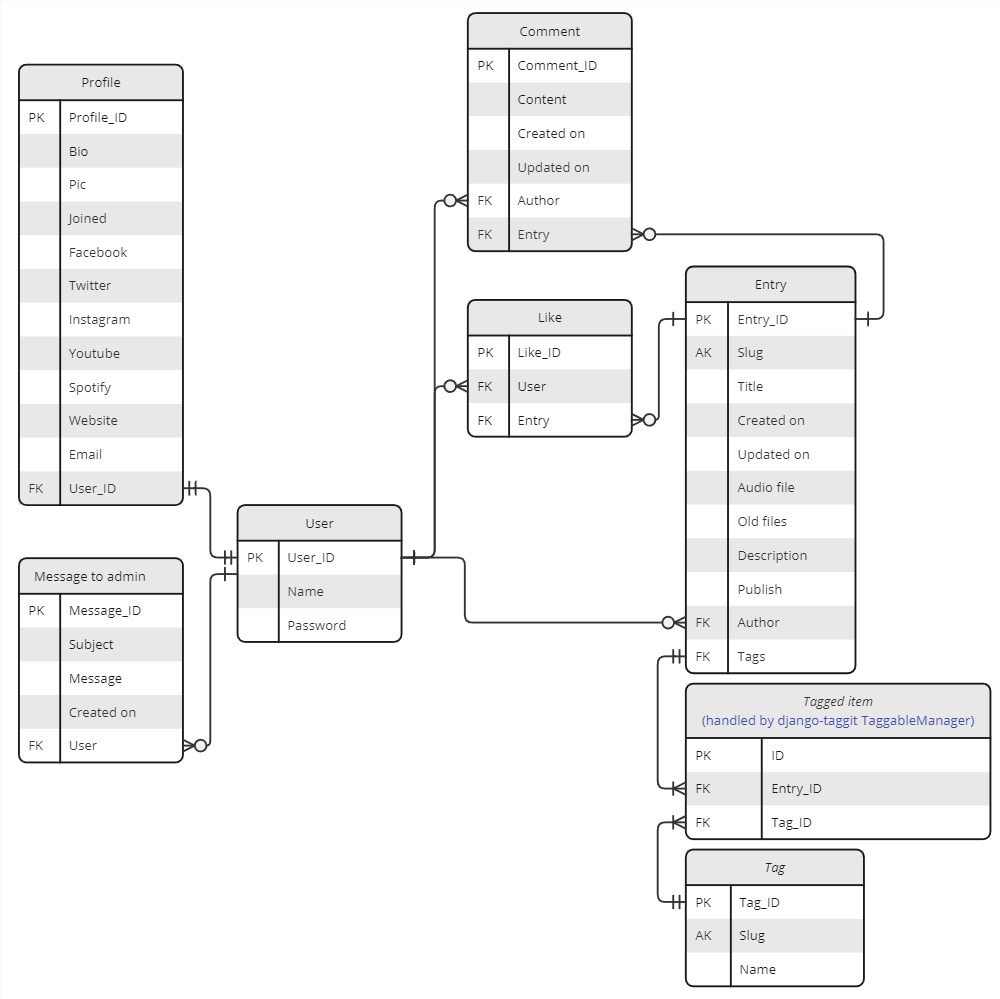

```
PortfolioProject4
├─ comments
│  ├─ admin.py
│  ├─ apps.py
│  ├─ forms.py
│  ├─ migrations
│  ├─ models.py
│  ├─ templates
│  │  └─ comments
│  │     └─ snippets
│  │        └─ comment_section.html
│  ├─ tests.py
│  ├─ urls.py
│  ├─ utils.py
│  ├─ views.py
│  ├─ __init__.py
│  └─ __pycache__
├─ entries
│  ├─ admin.py
│  ├─ apps.py
│  ├─ forms.py
│  ├─ migrations
│  ├─ models.py
│  ├─ templates
│  │  └─ entries
│  │     ├─ entry_details.html
│  │     ├─ entry_form.html
│  │     └─ snippets
│  │        ├─ entry_cards.html
│  │        └─ entry_fullpage.html
│  ├─ tests.py
│  ├─ urls.py
│  ├─ utils.py
│  ├─ views.py
│  ├─ __init__.py
│  └─ __pycache__
├─ likes
│  ├─ admin.py
│  ├─ apps.py
│  ├─ forms.py
│  ├─ migrations
│  ├─ models.py
│  ├─ templates
│  │  └─ likes
│  │     └─ snippets
│  │        └─ like_comment_summary.html
│  ├─ tests.py
│  ├─ urls.py
│  ├─ views.py
│  ├─ __init__.py
│  └─ __pycache__
├─ mainpage
│  ├─ admin.py
│  ├─ apps.py
│  ├─ forms.py
│  ├─ migrations
│  ├─ models.py
│  ├─ signals.py
│  ├─ templates
│  │  └─ mainpage
│  │     ├─ about.html
│  │     ├─ index.html
│  │     └─ snippets
│  │        └─ modal.html
│  ├─ tests.py
│  ├─ urls.py
│  ├─ utils.py
│  ├─ views.py
│  ├─ __init__.py
│  └─ __pycache__
├─ manage.py
├─ musiclab
│  ├─ adapter.py
│  ├─ asgi.py
│  ├─ settings.py
│  ├─ urls.py
│  ├─ wsgi.py
│  ├─ __init__.py
│  └─ __pycache__
├─ Procfile
├─ requirements.txt
├─ runtime.txt
├─ static
│  ├─ css
│  │  ├─ base-styles.css
│  │  ├─ entries-styles.css
│  │  ├─ form-styles.css
│  │  ├─ mainpage-styles.css
│  │  ├─ modal-styles.css
│  │  └─ user-profile-styles.css
│  ├─ images
│  │  ├─ default_profile.jpg
│  │  ├─ default_profile.webp
│  │  ├─ hands-holding-music-instruments_53876-148189.jpg
│  │  ├─ hands-holding-music-instruments_53876-148189.webp
│  │  ├─ logo-inst-l.png
│  │  ├─ logo-inst-l.webp
│  │  ├─ saxophone-white-background_lg.jpg
│  │  └─ saxophone-white-background_lg.webp
│  ├─ js
│  │  ├─ base.js
│  │  ├─ comments.js
│  │  ├─ entries.js
│  │  ├─ filters.js
│  │  ├─ form_script.js
│  │  └─ likes.js
│  └─ readme-assets
│     └─ musiclab-erd.jpg
├─ staticfiles
├─ templates
│  ├─ 400.html
│  ├─ 403.html
│  ├─ 404.html
│  ├─ 500.html
│  ├─ account
│  │  ├─ login.html
│  │  ├─ logout.html
│  │  ├─ signup.html
│  ├─ base.html
│  ├─ navbar.html
│  ├─ pagination.html
│  ├─ sidebar.html
├─ users
│  ├─ admin.py
│  ├─ apps.py
│  ├─ forms.py
│  ├─ migrations
│  ├─ models.py
│  ├─ signals.py
│  ├─ templates
│  │  └─ users
│  │     ├─ dashboard.html
│  │     ├─ dashboard_entry.html
│  │     ├─ dashboard_user_comments.html
│  │     ├─ dashboard_user_likes.html
│  │     ├─ profile.html
│  │     ├─ profile_form.html
│  │     └─ snippets
│  │        └─ profile_card.html
│  ├─ tests.py
│  ├─ urls.py
│  ├─ utils.py
│  ├─ views.py
│  ├─ __init__.py
│  └─ __pycache__
└─ __pycache__

```