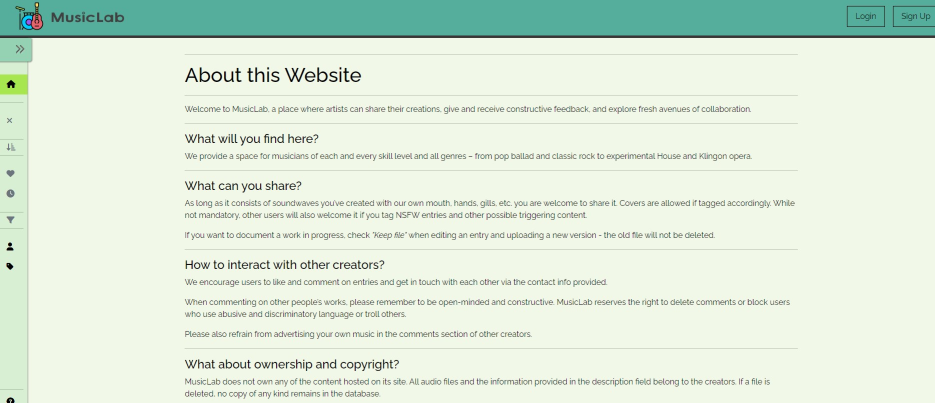
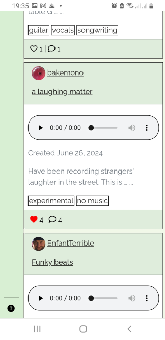
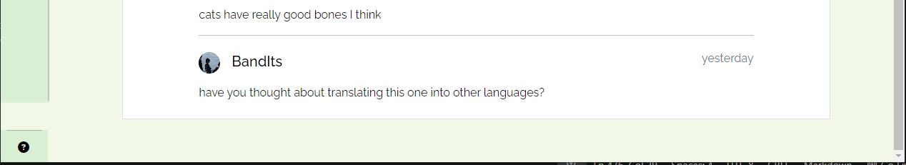

# MusicLab
MusicLab is a music blog - a place where artists can share their creations, give and receive constructive feedback, and explore fresh avenues of collaboration. It is a space for musicians of each and every skill level and all genres to show their music to the public and start conversations about music-related topics.


The live link for "MusicLab" can be found [HERE](https://music-lab-11c9945eb758.herokuapp.com/)

## Table of Contents

## UX

### Site Purpose:
The intent of the site is to provide a space for a community of aspiring musicians and songwriters of all skill levels where they can share their work, discuss it with others, receive feedback on works in progress, and maybe even make friends or start a band.

### Site Goal:
The goal is to have a platform that connects creators and helps them support each other. It aims to reduce the hurdle of getting your own music heard as an amateur by encouraging drafts and work-in-progress uploads.

### Audience:
Creators, musicians, songwriters of all ages and skill levels with a passion for music. The site is mainly geared toward amateurs, hobbyists and unpublished creators looking for feedback or collaboration opportunities.

### Current User Goals:
For creators to quickly upload their music with a description and to browse and comment on other creators' entries.

### New User Goals:
For visitors to get immediate access to all published musical creations and to feel intrigued about joining and uploading their own work.

### Future Goals:
An important feature that I did not had the time to implement yet is "Collaboration projects". This feature would greatly help promote the core principle of the page - bringing creators together on joint projects - by streamlining the work on a project and reducing some of the social hurdles of teamwork.
In short, creators could start a collab project and invite specific users to join or allow all interested users to request admission to the project. All members would be able upload their demos and mixes to the project and discuss them, before releasing the final master to the public.


## User Stories

### Admin stories:
#### As an admin:
1. I can **moderate entries** so that **they are tagged correctly and no inappropriate content is uploaded**.
2. I can **moderate comments** so that **the feedback provided is appropriate**.
3. I can **delete users who break the rules** so that **toxic behavior is discouraged**.

### Visitor stories:
#### As a visitor:
1. I can **visit the site** so that **I can browse entries made by the creators**.
2. I can **open individual user profiles** so that **I can find information about a creator**.
3. I can **sort all entries by date or likes** so that **I can easily find the newest and the most popular entries**.
4. I can **filter all entries by tag** so that **I can explore certain styles, languages, instruments etc**.
5. I can **filter all entries by username** so that **I can explore new artists**.
6. I can **read the 'About' page** so that **I am informed about the principles and rules of this website**.
7. I can **sign up** so that **I can start contributing by liking, commenting, or adding entries**.

### Creator stories:
#### As a creator:
1. I can **update my user profile** so that **others get to know me and find out how to contact me**.
2. I can **upload my work** so that **I can share it with others and receive feedback**.
3. I can **edit my entries** so that **I can change their presentation and add additional audio files**.
4. I can **add audio files to my existing entry** so that **others can follow my work in progress**.
5. I can **make my entry private** so that **it is not shown to others**.
6. I can **delete my entry** so that **it gets deleted from the database and becomes unavailable**.
7. I can **like an entry** so that **other creators feel appreciated**.
8. I can **unlike an entry** so that **I can remove entries from my favorites**.
9. I can **view all entries I liked** so that **I can quickly find my favorite creations**.
10. I can **leave a comment for an entry** so that **I can start or partake in discussions and connect with others**.
11. I can **edit my comment** so that **I can fix errors**.
12. I can **delete my comment** so that **it is no longer available**.
13. I can **view all comments I have written** so that **I can continue my discussions**.
14. I can **submit a message to the admin** so that **I can give feedback on the site functionality, report an issue or ask something**.
15. I can **log out of my account** so that **unauthorized access is prevented**.

## Design

Being someone who gets easily distracted by popups, banners, notifications, and other elements demanding immediate attention, and having watched others struggle with an overwhelming flood of information and hard-to-find functions, I tried to focus on readability and ease-of-use when choosing link placement, fonts, and icons. I strived to build an accessible page that is easy to navigate and puts the content - the audio files - first.
To achieve this, I ...
- used a simple, readable font
- used commonly known icons
- refrained from using too many colors, too dark or too bright backgrounds
- made sure the audio elements would not autoplay on load
- made sure that links and buttons were selectable with the ```TAB``` key
- made sure to hide or disable elements irrelevant to the current page

### Planning
As part of the planning process, I made a list of all basic functions that an MVP should have and drafted the basic page layout.

The project's kanban board with the core user stories can be found here: [MusicLab Kanban board](https://github.com/users/RikaIljina/projects/2/views/1)

### Wireframes:

#### Main page:


#### Main page on mobile:


#### 'User profile' page:


#### 'Add new entry' page:


### Sitemap:


### Database schema:


### Color Scheme:


### Typography:
The page uses the font "Raleway" for all text.
The font is being imported from Google Fonts.
When users add a profile bio or a song description, they can use the Summernote richtext editor to format their text. There, they can add some basic formatting as well as choose one of the following fonts:
- Arial
- Arial Black
- Courier New
- Helvetica

### Imagery:
The website uses images sparingly to not distract from the main purpose of the site.
The logo was adapted from an icon found on Flaticon.
The background images on the 'Login' and 'Sign up' pages are taken from Freepik. They create a pleasant backdrop for the otherwise plain pages, while their musical theme prepares the user for a hopefully amazing musical experience.
See credits for source attribution.


## Features

### Existing Features:

#### Navigation

The website has a navigation bar containing the logo and the account buttons at the top. This bar is shown on every page.

Navigation bar on desktops:


Navigation bar on mobile devices (logged-in view):


The website also has a collapsible sidebar that is shown everywhere but on the Login/Signup pages and the error pages. The sidebar automatically collapses on mobile devices and can be left in an expanded or collapsed state by the user on larger screens.
The sidebar icons differ depending on whether the user is on the main page or in their personal dashboard.

- Sidebar on desktops, main page:


- Sidebar on desktops, dashboard:


- Sidebar on mobile devices, profile:


- Sidebar on mobile devices, dashboard:


#### Viewing
All users have access to the main page with all entries in card form:


Users can click the card or the card title to open the full-page view of the card containing the entry description and the comment section:


Users can also click on the username on a card to navigate to the profile page of a user containing their 'About me' and 'Contact' info as well as all their public entries in card form:


Users can click the 'About' link at the bottom of the sidebar to access the 'About' page outlining the idea behind the website and the rules and providing a way to send feedback to the site admins:




Authenticated users can view all their public and private entries in their personal dashboard. Authenticated users can also view their 'Comments' and 'Favorites' pages:


#### Editing

Authenticated users can click on the 'Edit' button on their profile page beneath their large avatar or click the 'Update profile' link in the dropdown menu in the upper navigation bar to open the "Edit profile" form and update their data:


Authenticated users can click on an existing entry to get access to the 'Edit'/'Delete' buttons:


A click on 'Edit' opens the 'Edit entry' form where users can change their entry data or upload another version of their song:


A click on 'Delete' opens a modal that asks for confirmation before deleting the song permanently:


Authenticated users can use the 'Like' button to like/unlike entries anywhere on the page where entries are displayed:



Authenticated users can edit and delete their comments on all pages where comments are displayed:


Authenticated users can send a message to the admins on the 'About' page:


#### Logging in

Users can use the 'Login'/'Sign up' buttons on the upper navbar to create an account or log in:


They can sign out via the link in the dropdown with their avatar and name in the navbar:


#### Error pages

The website has four custom  error pages:
- 400 for bad requests
- 403 for cases where users try to access a page or perform an action they are not authorized to
- 404 for pages that don't exist
- 500 for server errors


All error pages provide a short description of the error and a link to get back to the main page.

### Future Features:

- [ ] Account management for users: Change password, reset password, delete account
- [ ] Collaboration page that allows creators to start joint projects
- [ ] Flagging option to allow users to report inappropriate content
- [ ] Direct messaging system for private user communication
- [ ] Notifications that inform creators about new comments or likes
- [ ] Follower feature
- [ ] Custom audio player

## Codebase

The project is based on the Django web framework. It consists of five apps - 
- ```Comments```
- ```Entries```
- ```Likes``` 
- ```Users```
- ```Mainpage```

...  and uses eight models, of which 
- ```Entry```
- ```Comment```
- ```Like```
- ```Profile```
- ```MessageToAdmin``` 

were created by me, ```User``` is the standard Django ```models.User``` class from ```django.contrib.auth``` managed by the ```django-allauth``` package, and ```tag``` and ```taggedItem``` are part of the ```django-taggit``` package.

### Project tree

<details>
<summary>Project file structure</summary>

```

PortfolioProject4
├─ comments
│  ├─ admin.py
│  ├─ apps.py
│  ├─ forms.py
│  ├─ migrations
│  ├─ models.py
│  ├─ templates
│  │  └─ comments
│  │     └─ snippets
│  │        └─ comment_section.html
│  ├─ tests.py
│  ├─ urls.py
│  ├─ utils.py
│  ├─ views.py
│  ├─ __init__.py
│  └─ __pycache__
├─ entries
│  ├─ admin.py
│  ├─ apps.py
│  ├─ forms.py
│  ├─ migrations
│  ├─ models.py
│  ├─ templates
│  │  └─ entries
│  │     ├─ entry_details.html
│  │     ├─ entry_form.html
│  │     └─ snippets
│  │        ├─ entry_cards.html
│  │        └─ entry_fullpage.html
│  ├─ tests.py
│  ├─ urls.py
│  ├─ utils.py
│  ├─ views.py
│  ├─ __init__.py
│  └─ __pycache__
├─ likes
│  ├─ admin.py
│  ├─ apps.py
│  ├─ forms.py
│  ├─ migrations
│  ├─ models.py
│  ├─ templates
│  │  └─ likes
│  │     └─ snippets
│  │        └─ like_comment_summary.html
│  ├─ tests.py
│  ├─ urls.py
│  ├─ views.py
│  ├─ __init__.py
│  └─ __pycache__
├─ mainpage
│  ├─ admin.py
│  ├─ apps.py
│  ├─ forms.py
│  ├─ migrations
│  ├─ models.py
│  ├─ signals.py
│  ├─ templates
│  │  └─ mainpage
│  │     ├─ about.html
│  │     ├─ index.html
│  │     └─ snippets
│  │        └─ modal.html
│  ├─ tests.py
│  ├─ urls.py
│  ├─ utils.py
│  ├─ views.py
│  ├─ __init__.py
│  └─ __pycache__
├─ manage.py
├─ musiclab
│  ├─ adapter.py
│  ├─ asgi.py
│  ├─ settings.py
│  ├─ urls.py
│  ├─ wsgi.py
│  ├─ __init__.py
│  └─ __pycache__
├─ Procfile
├─ requirements.txt
├─ runtime.txt
├─ static
│  ├─ css
│  │  ├─ base-styles.css
│  │  ├─ entries-styles.css
│  │  ├─ form-styles.css
│  │  ├─ mainpage-styles.css
│  │  ├─ modal-styles.css
│  │  └─ user-profile-styles.css
│  ├─ images
│  │  ├─ default_profile.webp
│  │  ├─ hands-holding-music-instruments_53876-148189.webp
│  │  └─ logo-inst-l.webp
│  ├─ js
│  │  ├─ base.js
│  │  ├─ comments.js
│  │  ├─ entries.js
│  │  ├─ filters.js
│  │  ├─ form_script.js
│  │  └─ likes.js
│  └─ readme-assets
│     └─ musiclab-erd.jpg
├─ staticfiles
├─ templates
│  ├─ ...
│  ├─ 400.html
│  ├─ 403.html
│  ├─ 404.html
│  ├─ 500.html
│  ├─ account
│  │  ├─ ...
│  │  ├─ login.html
│  │  ├─ logout.html
│  │  ├─...
│  ├─ base.html
│  ├─ navbar.html
│  ├─ pagination.html
│  ├─ sidebar.html
├─ users
│  ├─ admin.py
│  ├─ apps.py
│  ├─ forms.py
│  ├─ migrations
│  ├─ models.py
│  ├─ signals.py
│  ├─ templates
│  │  └─ users
│  │     ├─ dashboard.html
│  │     ├─ dashboard_entry.html
│  │     ├─ dashboard_user_comments.html
│  │     ├─ dashboard_user_likes.html
│  │     ├─ profile.html
│  │     ├─ profile_form.html
│  │     └─ snippets
│  │        └─ profile_card.html
│  ├─ tests.py
│  ├─ urls.py
│  ├─ utils.py
│  ├─ views.py
│  ├─ __init__.py
│  └─ __pycache__
└─ __pycache__
```

</details>

### HTML files
Due to the nature of the website, the same or similar elements have to be shown multiple times per page or on different pages filled with different data and rendered and styled for a different context. For this reason, I was striving for a modular structure that would help me avoid copy-pasting elements. As a result, I ended up with reusable snippets that are included in the main html pages which all extend the ```base.html``` template.

For example:

```
Home
├─ template base.html
│  ├─ includes navbar.html
│  ├─ includes sidebar.html
│  ├─ extended by index.html
│  │  │  ********** LOOP ***********
│  │  ├─ includes entry_cards.html
│  │  │  └─ includes like_comment_summary.html
│  │  │  ********* ENDLOOP ***********
└─ └─ └─ includes pagination.html
```

### Database
PostgreSQL is used as a database. The link to the postgres instance was kindly provided by CodeInstitute.

In order to optimize database queries, I used the methods ```select_related()``` and ```prefetch_related()``` where applicable and was able to bring the amount of queries on the website down to 4-11 queries per page, regardless of the amount of content retrieved.

I tried to automate certain DB tasks to make sure they would be triggered by users and admin alike. To this end, I used signals and method overriding in model, form, and admin classes.

| Task | Module | Method |
|---|---|---|
| Create a user profile automatically after user registration | ```users/signal.py``` | ```post_save```, ```create_profile()``` |
| Delete the profile picture from cloud storage when a profile is deleted | ```users/signal.py``` | ```pre_delete```, ```delete_profile_pic()``` |
| Delete the old profile picture from cloud storage when a profile is updated with a new picture | ```users/forms.py``` | ```class ProfileForm```, override ```save()``` |
| Delete the old profile picture from cloud storage when a profile is updated with a new picture in the admin panel | ```users/admin.py``` | ```class ProfileAdmin```, override ```save_model()```  |
| Delete all tags with no associated entries whenever an entry is saved or deleted | ```mainpage/signal.py``` | ```post_save``` and ```post_delete```, ```delete_tags()``` |
| Delete all associated audio files from cloud storage when an entry is deleted  | ```entries/models.py``` | ```class Entry```, override ```delete()``` |
| Delete all associated audio files from cloud storage when entries are deleted in bulk by admin | ```entries/admin.py``` | ```class EntryAdmin```, override ```delete_queryset()``` |
| Depending on user choice: save the URL and ID of the old audio file as a previous version in the entry object OR delete the old audio file from cloud storage | ```entries/forms.py``` | ```class EntryForm```, override ```save()``` |
| Depending on admin choice: save the URL and ID of the old audio file as a previous version in the entry object OR delete the old audio file from cloud storage | ```entries/admin.py``` | ```class EntryAdmin```, override ```save_model()``` |
| Pre-validate audio file before uploading it to the cloud storage  | ```entries/forms.py``` | ```class EntryForm```, override ```clean_audio_file()``` |
| Pre-validate image file before uploading it to the cloud storage | ```users/forms.py``` | ```class ProfileForm```, override ```clean_pic()``` |
| Prevent a Like object from being saved if the request user is also the entry author | ```likes/models.py``` | ```class Like```, overriding ```save()``` |
| Raise ValidationError if the username chosen by the user exceeds 20 characters | ```musiclab/adapter.py``` | ```class UsernameMaxAdapter```, override ```clean_username()``` |
| Raise ValidationError if the user has already used the same title for another entry and the slug consisting of {title}-{username} is not unique, and save slug in the Entry object if it is unique | ```entries/forms.py``` | ```class EntryForm```, override ```clean_title()``` |
| Raise ValidationError in the admin panel if the user has already used the same title for another entry and the slug consisting of {title}-{username} is not unique | ```entries/admin.py``` | ```class EntryFormExtension```, override ```clean()``` |
| After the custom slug has been validated with clean(), save the slug in the Entry object | ```entries/admin.py``` | ```class EntryAdmin```, override ```save_model()``` |


#### Custom validation
I use custom validation for the following data:
- The length of the username may not exceed 20 characters
- The uploaded images must have the content type 'image/jpeg' or 'image/png' and may not exceed 1MB
- The uploaded audio files must have the content type 'audio/mpeg' and may not exceed 10MB
- The slugs are constructed from {title}-{author} to allow different users to use the same titles for their entries. Special consideration went into non-latin titles that I wanted to allow for the entries. To make sure that all entries receive easily readable, unique slugs, I used ```slugify(unidecode(slug_string))```. ```slugify``` converts all whitespace into single dashes, while ```unidecode``` takes care of the transliteration of non-latin into latin characters. Thus, the titles 'Amerika' and 'америка' will produce the same slug and will raise a ValidationError in the entry form. 

#### Taggit integration
```django-taggit```is used for tag management. Since the Tag model creates a many-to-many relationship with the Entry model, the following code is needed to properly save the tags entered into the form field and link them to the entry:
```
entry = entry_form.save(commit=False)
entry.save()
entry_form.save_m2m()
```
However, I ran into a problem when overriding the ```save()``` method of my ```EntryForm``` class:
When I tried initializing the instance with ```instance = self.instance``` for further modification and then returned the instance back to the view, the m2m field was not saved. Instead, I had to initialize the instance with ```instance = super().save(commit=False)``` to make it work. I am not sure what is happening behind the scenes here.

#### Cloudinary integration
I use the Cloudinary cloud service for user file storage and handle the file upload directly via the ```CloudinaryField``` model field. However, since deleting an object associated with a Cloudinary file does not automatically remove the file in the cloud storage, I have implemented the mechanism of file destruction via ```cloudinary.uploader.destroy(file.public_id, invalidate=True)``` where it is relevant.

#### Summernote integration
Since I decided to allow users to use custom formatting in their 'About me' and 'Entry description' sections, I had to implement a richtext editor and adjust it for scope and safety reasons. I integrated Summernote by using ```SummernoteWidget``` as a widget in the ```Meta``` section of the form classes and made sure to adjust its settings via ```SUMMERNOTE_CONFIG``` in settings.py, disabling attachments and drag&drop, removing the option of embedding code, and leaving a few basic styling options and fonts.
Summernote uses the ```django-bleach``` module to sanitize HTML input, so I deemed it sufficiently safe to render the user description and bio texts with the template filter ```{{ description|safe }}``` and display the content.

## Testing

### Validator Testing

| Files | Validator | Result |
|---|---|---|
| All *.py files in the main project folder and the app folders except for migrations | pycodestyle (PEP8) | Pass |
| base.js | [JSHint](https://jshint.com/) | Pass |
| comments.js | [JSHint](https://jshint.com/) | Pass |
| entries.js | [JSHint](https://jshint.com/) | Pass |
| likes.js | [JSHint](https://jshint.com/) | Pass |

### Responsiveness testing

| Goal | Screen width | Result |
|---|---|---|
| The logo and button sizes in the upper nav bar shrink to fit in one row on a Galaxy Fold. | max 768px | Pass |
| The dropdown menu of the logged-in user is fully visible. | max 768px | Pass |
| Entry cards shown in a row always have the same size. | min 768px | Pass |
| The amount of entry cards shown in a row responds to screen size changes. | all | Pass |
| Only one card is shown per row. | max 768px | Pass |
| The sidebar is shown as expanded the first time the user visits the main page. | min 768px | Pass |
| When expanded, the sidebar pushes the content to the right and fills a small percentage of the screen. | min 768px | Pass |
| When expanded, the sidebar overlaps the content and fills the full width of the screen. | max 768px | Pass |
| If the user clicks on the toggle button to expand or collapse the sidebar, it stays expanded or collapsed resp. on the next page the user navigates to. | min 768px | Pass |
| The sidebar never stays extended but rather collapses as soon as a sidebar link is clicked. | max 768px | Pass |
| Form labels and fields are stacked in a column rather than shown next to each other. | max 768px | Pass |
| The elements of the user profile section are stacked in a column rather than shown in a row. | max 768px | Pass |
| On all pages, all page elements are contained within their parent container and behave in a responsive way | 280px - 2560px | Pass |


### C.R.U.D. testing
| Goal | Result |
|---|---|
|**Create:**|
| A new user account can be created by the admin or a website visitor | Pass |
| Creating a new account automatically creates exactly one associated user profile | Pass |
| An authenticated user can create one or several entries by filling out all required fields | Pass |
| An authenticated user can create one or several comments associated with exactly one entry for any public entry or for any of their own entries | Pass |
| An authenticated user can create exactly one like associated with one entry for any public entry except their own | Pass |
| An authenticated user can create one or several messages to the admin by filling out all required fields | Pass |
|**Read:**|
| When a website visitor accesses a page showing user entries, the data for each accessible entry is read from the database and parsed correctly | Pass |
| For each entry, all associated likes and comments are counted and the amounts are displayed correctly  | Pass |
| For each entry, all associated tags are retrieved and displayed | Pass |
| When a website visitor accesses the comment section of an entry, all comments associated with the entry are retrieved and their author and content displayed | Pass |
| When a website visitor accesses a user profile page, the profile data as well as the user's public entries are retrieved and displayed | Pass |
| When a website visitor clicks on a tag anywhere on the site, all entries associated with that tag are retrieved and displayed | Pass |
| When an authenticated user opens their own dashboard, their profile data as well as all private and public entries are displayed | Pass |
| When an authenticated user clicks on the 'My Favorites' link, all entries liked by that user are retrieved and displayed | Pass |
| When an authenticated user clicks on the 'My comments' link, all comments written by that user are retrieved and shown with the author and title of the commented entry | Pass |
| When the admin clicks on the 'Message to admin' link in the admin panel, all messages submitted by authenticated users are retrieved and shown along with the username and subject of the message | Pass |
|**Update:**|
| When an authenticated user opens their 'Update profile' form, removes or adds data and submits the changed form, the profile is updated in the database | Pass |
| When an authenticated user uploads a new profile picture, the old picture is permanently deleted from the cloud storage it was uploaded to and is no longer accessible | Pass |
| When an authenticated user opens their 'Edit entry' form, removes or adds data and submits the changed form, the entry is updated in the database | Pass |
| When an authenticated user uploads a new audio file and unchecks the 'Keep file' box, the old file is permanently deleted from the cloud storage it was uploaded to and is no longer accessible | Pass |
| When an authenticated user uploads a new audio file and checks the 'Keep file' box, the old file is kept in the cloud storage and its link is added to the appropriate entry field | Pass |
| When an authenticated user clicks on a 'Delete file' button in the 'Edit entry' view, the associated file is permanently deleted from the appropriate entry field and from the cloud storage it was uploaded to and is no longer accessible | Pass |
|**Delete:**|
| When an authenticated user clicks on the 'Like' button on a liked entry in any view, the like is deleted from the database | Pass |
| When an authenticated user clicks on the 'Delete comment' button next to their own comment, the comment is deleted from the database | Pass |
| When an authenticated user clicks on the 'Delete entry' button on the 'Entry details' page in their dashboard, the entry is deleted and all associated audio files are destroyed in the cloud storage | Pass |
| When the admin deletes a profile in the admin panel, the profile data is deleted from the database and the associated image file destroyed in the cloud storage | Pass |
| When the admin deletes a user in the admin panel, all user data including the user's profile, entries, comments, and likes are deleted from the database and the associated uploaded files destroyed in the cloud storage | Pass |
|**Admin access:**|
| In the admin panel, the admin can perform create, read, update, and delete actions on any database object, including tags and likes | Pass |


### User stories

| Story | Implementation | Result |
|---|---|---|
|**As an admin:**|
| I can **moderate entries** so that **they are tagged correctly and no inappropriate content is uploaded**. | Admin panel gives CRUD access to all entry objects | Pass |
| I can **moderate comments** so that **the feedback provided is appropriate**. | Admin panel gives CRUD access to all comment objects | Pass |
| I can **delete users who break the rules** so that **toxic behavior is discouraged**. | Admin panel gives CRUD access to all user objects | Pass |
| **As a visitor:** |
| I can **visit the site** so that **I can browse entries made by the creators**. | Opening the main page shows the navbar, the expanded sidebar and a collection of paginated entries for the visitor to browse | Pass |
| I can **open individual user profiles** so that **I can find information about a creator**. | Clicking on a user link shows the complete user profile and the paginated public entries of that user | Pass |
| I can **sort all entries by date or likes** so that **I can easily find the newest and the most popular entries**. | On any page with an entry collection, selecting a 'Sort by' option in the sidebar re-orders all entries accordingly | Pass |
| I can **filter all entries by tag** so that **I can explore certain styles, languages, instruments etc**. | On any page with an entry collection, selecting a tag name in the 'Filter by tag' section of the sidebar retrieves and shows only entries associated with that tag | Pass |
| I can **filter all entries by username** so that **I can explore new artists**. | On any page with an entry collection, selecting a username in the 'Filter by user' section of the sidebar retrieves and shows only entries associated with that user | Pass |
| I can **read the 'About' page** so that **I am informed about the principles and rules of this website**. | Clicking on the 'About' link that is always visible at the bottom of the viewport on the sidebar opens the 'About' page | Pass |
| I can **sign up** so that **I can start contributing by liking, commenting, or adding entries**. | Clicking on the 'Sign up' button in the upper nav bar opens a sign up page. If the user submits the form with valid data, an account is created for that user. | Pass |
|**As a creator:**|
| I can **update my user profile** so that **others get to know me and find out how to contact me**. | Clicking on the 'Edit' button below the user avatar on the main dashboard page or selecting 'Update profile' in the dropdown menu in the upper nav bar opens an 'Edit profile' page where the user can edit their data. This page is also shown right after user registration. | Pass |
| I can **upload my work** so that **I can share it with others and receive feedback**. | In the dashboard, clicking on the 'Add entry' button on the sidebar opens the 'Add entry' form. If the user submits the form with valid data, an entry is created. | Pass | 
| I can **edit my entries** so that **I can change their presentation and add additional audio files**. | In the dashboard, clicking on an entry card and then on the 'Edit entry' button on the entry details page opens the 'Edit entry' form. If the user submits the form with valid data, the entry is updated. | Pass | 
| I can **add audio files to my existing entry** so that **others can follow my work in progress**. | In the dashboard, clicking on an entry card and then on the 'Edit entry' button on the entry details page opens the 'Edit entry' form. There, the user can select a new audio file to upload and check the checkbox 'Keep file' in order to keep the old version that can then be accessed on the entry details page. | Pass |
| I can **make my entry private** so that **it is not shown to others**. | In the dashboard, clicking on an entry card and then on the 'Edit entry' button on the entry details page opens the 'Edit entry' form. There, the user can select the radio button 'Private' and save the entry to mark it as 'Private' and remove it from all public entry views. | Pass |
| I can **delete my entry** so that **it gets deleted from the database and becomes unavailable**. | In the dashboard, clicking on an entry card and then on the 'Delete entry' button on the entry details page opens a delete confirmation modal. Clicking on the 'Yes, delete' button on the modal permanently deletes the entry and all associated data. | Pass |
| I can **like an entry** so that **other creators feel appreciated**. | On any page showing entries, provided the user is not the entry author and has not liked it already, clicking on the heart-shaped 'Like' button creates a like and changes the button style to show the user that they have liked that entry. | Pass |
| I can **unlike an entry** so that **I can remove entries from my favorites**. | On any page showing entries, if the style of the heart-shaped 'Like' button shows that the user has liked the entry before, clicking on the button deletes the like and changes the button style to show the user that they have not liked that entry. | Pass |
| I can **view all entries I liked** so that **I can quickly find my favorite creations**. | In the dashboard, clicking on 'My favorites' on the sidebar opens the 'Favorites' page showing a collection of all entries the user has liked. Unliking the entries on that page removes them from the page. | Pass |
| I can **leave a comment for an entry** so that **I can start or partake in discussions and connect with others**. | On any page showing a comment section, entering text into the comment field next to the user's avatar and clicking 'Submit' creates a comment that is immediately shown in the comment section. | Pass |
| I can **edit my comment** so that **I can fix errors**. | On any page showing a comment section, clicking on the 'Edit' button below the user's own comment displays a text area containing the comment text and allows the user to modify it. Submitting the comment via the 'Update' button shows the updated comment in the comment section. | Pass |
| I can **delete my comment** so that **it is no longer available**. | On any page showing a comment section, clicking on the 'Delete' button below the user's own comment opens a delete confirmation modal. Clicking on the 'Yes, delete' button in the modal permanently deletes the comment. | Pass |
| I can **view all comments I have written** so that **I can continue my discussions**. | In the dashboard, clicking on 'My comments' on the sidebar opens the 'Comments' page showing a collection of all comments written by the user, along with a link to the original entry and the entry author. Comments can be edited and deleted on this page. | Pass |
| I can **submit a message to the admin** so that **I can give feedback on the site functionality, report an issue or ask something**. | Clicking the always visible 'About' link on the sidebar at the bottom of the viewport opens a page with a message form. Submitting the form with valid data creates a message object that the admin can see in the admin panel. | Pass |
| I can **log out of my account** so that **unauthorized access is prevented**. | In the dropdown menu in the upper nav bar, clicking on 'Sign out' terminates the user session and redirects them to the main page in the role of an anonymous user. | Pass | 

### Features

| Goal | Result |
|---|---|
| Clicking the toggle button at the top of the sidebar collapses or expands the sidebar, switching between showing only icons or icons and text. | Pass |
| The toggle icon '<< >>' changes according to the state of the sidebar. | Pass |
| Clicking on the "user" or "tag" filter option expands the sidebar, showing the full list of selectable usernames or tags. | Pass |
| On screens larger than 768px, selecting any username or tag to filter by leaves the "user" or "tag" filter section expanded, whereas clicking on any other dashboard element collapses the filter section. | Pass |
| The sidebar always stretches down to the bottom of the page, no matter the main container size. | [Fail](#unfixed-bugs 'Unfixed bugs') |
| The 'About' button always stays at the bottom of the viewport. | Pass |
| Hovering over a 'Like' button while not signed in shows a tooltip informing the user they can log in to like entries. | Pass |
| To open the full-page view of an entry, users can click anywhere on an entry card, with all other links and buttons on that card still being clickable individually. | Pass |
| The main audio file is always playable in any view showing an entry card collection. | Pass |
| A preview of the entry description is shown on the small entry card in plain text. | Pass |
| Clicking on any tag located on an entry card opens the filter view, showing all entries with the selected tag. | Pass |
| Clicking on a social link or any other link in the 'About me' section on the user profile page opens the link in a new tab. | Pass |
| Clicking on any 'Delete' button on the site opens a modal that requires the user to confirm the delete action before modifying the database. | Pass |

### Error testing

| Goal | Result |
|---|---|
| Trying to log in with an incorrect username or password shows a permanent tooltip with the description of the error. | Pass |
| Trying to sign up with an already existing username, an insecure password, or not entering the same password twice shows permanent tooltips with the description of the errors. | Pass |
| Trying to add or edit an entry by submitting invalid or empty data shows error messages and permanent tooltips with the description of the errors. | Pass |
| Trying to edit a profile by submitting invalid data shows error messages and permanent tooltips with the description of the errors. | Pass |
| Trying to add or edit an entry by submitting invalid or empty data shows error messages and permanent tooltips with the description of the errors. | Pass |
| Trying to add or edit a comment by submitting an empty field shows an error message. | Pass |
| A page trying to display entries for a user or a tag and receiving an empty object because no such entries exist, displays an empty page with a 'Nothing created yet' line instead of throwing a server error. | Pass |
| Trying to access a url that does not exist shows the 'Error 404' page. | Pass |
| In case of issues with the database or uncaught code errors, the 'Error 500' page is shown. | Pass |
| Trying to perform any CRUD operations as an unauthenticated user results in an 'Error 403' page, denying the user access to the information/operation. | Pass |
| Trying to perform unauthorized CRUD operations as an authenticated user (access another user's dashboard via url, edit/delete another user's entry, profile, or comment, add/delete another user's like) results in an 'Error 403' or 'Error 404' page depending on the operation. | Pass |
| Trying to access the admin panel with the credentials of a user account is prevented by the Django admin page. | Pass |


### Fixed bugs
During development, I encountered several bugs that I was largely able to fix on the spot. Some of the more prominent ones were:

- When trying to validate the custom slug in the ```save_model()``` method of the admin class ```EntryAdmin```, all errors went to the 'Server error' page instead of simply showing a validation error in the form. After some research, I created a new ModelForm ```EntryFormExtension``` with the overridden ```clean()``` method and linked it to the ```EntryAdmin``` class via ```get_form()```. Now I could validate the slug inside the ```clean()``` method and show validation errors in the form. However, I could not save the validated slug right there in ```EntryFormExtension``` because the instance didn't seem to give me access to the Entry object. Therefore, after a successful validation, the ```EntryAdmin``` class recreates and finally saves the slug in its own ```save_model()``` method. This seems to be a clunky and error-prone process and should be revised in the future.

- When trying to keep a collapsed section open inside the sidebar in a specific view, I added and removed the ```show``` class from the section's class list before realizing that I was circumventing the collapsible functionality and the ```aria-expanded``` attribute. I made sure to use the proper Bootstrap method ```$(element).collapse("hide")``` instead.

- When trying to upload a file via the POST method of a form, I found that no file had been passed on to the request. After some research, I understood that a form receiving a file upload needs the attribute ```enctype="multipart/form-data"``` and that its instance must receive ```request.FILES``` in its constructor: ```form = EntryForm(request.POST, request.FILES)```

- In the ```save()``` method of ```EntryForm```, I have code checking whether the user is trying to upload a new file while keeping the old file. I checked for changes with ```if "audio_file" in self.changed_data``` and then made the mistake of assuming that this expression being true meant that I could get all attributes of my old file via ```old_file = self.initial["audio_file"].public_id```. Fortunately, I noticed the issue when I tried to create a new entry, selected a file in the uploader, and then left the description field blank to cause an error. After the validation error, I again added the file for upload, filled out all fields and submitted the form, only to get a server error. Apparently, a change in the audio file field had been registered in ```self.changed_data``` the first time I tried to add a file before causing the ValidationError, but since no file was uploaded, ```self.initial["audio_file"]``` was empty, which caused an AttributeError.
I changed the code to 
```
old_file = self.initial.get("audio_file")
if "audio_file" in self.changed_data and old_file:
```


### Issues and caveats

**Sidebar**

I decided to have a collapsible sidebar with all relevant site operations always accessible to the user. To that end, I first used a template sidebar that relied on Bootstrap classes for responsiveness. However, after adding features and functionality to my pages, I realized that I would need to control the sidebar via JavaScript. Instead of rethinking it completely and building it from scratch as a JS-controlled element, I tried to work with and around the bootstrap classes, constantly fixing bugs while creating new ones, which cost me a lot of time and effort. I realize that I should have thought it through from the start. At the moment, it mostly works as intended (see [Unfixed bugs](#unfixed-bugs 'Unfixed bugs') for rare style issue), but I feel like the JS code is bulky and probably much slower than it could be.

**Filtering**

Filtering by user only makes sense with a rather small user base. Should the site have thousands of users, retrieving them all to scroll through makes no sense from a UX perspective.
The same goes for tags: since I allow users to enter their own tags, theoretically there is no limit to how many tags could accumulate in the database in the future. Thus, my filtering feature can only be seen as a temporary measure.
It should be replaced by a free text search to allow users to find tags, usernames, and titles. To this end, indexing and search vectors must be implemented.
Also, a handful of meaningful categories should be added as top-level tagging to help users with labelling their work and to allow for quick and useful filtering.

**User form input**

The ```TextField``` models that receive user input for the entry.description and profile.bio data have no upper limit as to their character length yet. This should be amended.
Also, no custom tag validation has been implemented yet, so users could enter tags that are too long and too many and thereby break the style of the sidebar and the cards.

**Admin optimization**

As mentioned before, I tried to optimize my website queries using the methods ```select_related()``` and ```prefetch_related()```, which worked well.
However, due to time restrictions, I was unable to achieve the same result on the admin page, where retrieving a list of 100 likes takes over 200 queries and 17000 ms. This needs to be researched and amended.

**Admin old file handling**

I allow users to keep uploaded files as a kind of "version history" when adding a new file to their existing entry. To make sure they see all their uploaded files and can delete them selectively while editing the entry, I added audio elements and delete buttons to the entry form view and wired up the buttons via ```forms.js```. I was yet unable to properly override the Django admin form view to achieve the same result in the admin panel. Thus, in order to delete a specific file from the version history, the admin has to manually copy the ID of the Cloudinary file from the text area containing the json dictionary ```old_files```, log into Cloudinary, delete the file there, and delete the key-value pair for the file from the text area. This is a tedious and error-prone process and must be fixed in the future.

**Dangerous Admin edits**

Right now, the admin can delete a user profile without deleting the user. If the user then logged into their account, they would be met with a server error due to the inability to retrieve their profile data which the site relies on. 
Thus, a check for the existence of a profile for active users needs to be implemented. This could, for example, happen immediately after user login, where the app would create a default profile for a user should no profile be found in the database.

A similar issue arises when the admin changes a username. If the user has already created entries, their slugs ({title}-{author}) contain the old username, which now could be used by a new user. To fix this, all entries of the affected user must be updated immediately after a username change. This could probably be implemented via signal or a custom script.

**Comments on private entries**

Users can decide at any time whether their entry should be public or private. If they set a previously public entry to private and that entry contains comments by other users, these comments will still be visible and editable in the 'My comments' section of the user's dashboard, albeit the entry itself won't be accessible via the link in the title. This issue requires some consideration.

**Quality of profile pictures**

I have not implemented any proper image resizing tools, which is probably why the avatar images are of pretty poor quality. They are being uploaded in their original size and then resized with CSS to 30px or 38px. I need to implement some cropping/resizing mechanics to improve on their quality.

Whenever an attempt is made to destroy a Cloudinary file via the method ```...```, the server returns a response containing a dictionary: ```{'result': 'ok'}``` or ... At the moment, my app just assumes that the file has been deleted properly and continues without giving feedback. In the future, these responses should be saved in a log, informing the admin whether the Cloudinary storage contains unassigned files that need to be deleted manually.

**Audio player**

The audio player is the custom HTML audio element, which might not work in all browsers and should be replaced with a custom playback option. Right now, it is possible to start several audio files at once, which should, of course, be prevented in the future.

**User upload issues**

My sister, who was helping me with filling the database with data, encountered server errors and application errors when trying to upload large audio files with otherwise correct form data. When I tried to upload the same files to the same accounts, I had no issues whatsoever and could not reproduce her errors. My assumption is that due to her quite slow upload speed, Heroku reacts with a timeout and terminates the connection. If this turns out to be a common issue for slower internet connections, I should revise the file upload mechanics to account for that.


### Unfixed bugs

1. Sometimes, when resizing the window too often and expanding elements in the main content container, the sidebar doesn't quite stretch to the bottom of the page. This issue seems rare but still needs investigating. The problem might be paddings/margins or wrong min-height values.


## Technologies Used
### Main Languages Used
- HTML5
- CSS3
- Javascript
- Python
- Django
- PostgreSQL

### Frameworks, Libraries & Programs Used

### Installed Packages:

## Deployment

## Credits
### Code used

All Python code was written by me unless clearly stated otherwise.
### Content
### Acknowledgments
